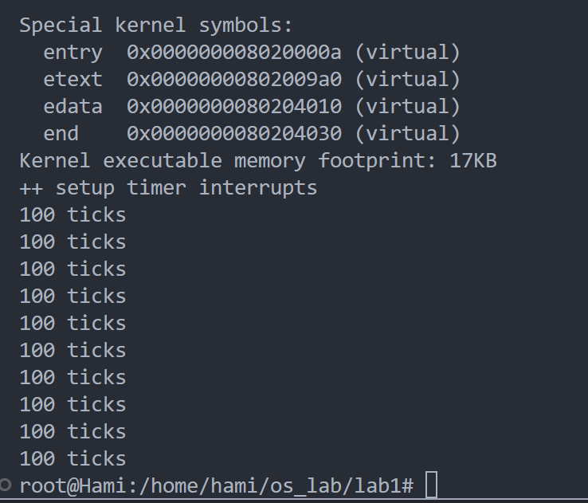

# lab1 断，都可以断

## 练习 1：理解内核启动中的程序入口操作
阅读`kern/init/entry.S`内容代码，结合操作系统内核启动流程，说明指令`la sp, bootstacktop`完成了什么操作，目的是什么？`tail kern_init`完成了什么操作，目的是什么？
## Answer:
### 对 `la sp, bootstacktop`的理解
- **作用**：这条指令将符号`bootstacktop`的地址加载到栈指针寄存器`sp`中。`sp`寄存器是栈指针，用于跟踪当前栈的顶部位置。`la`是`load address"`的缩写，它将地址加载到寄存器中。
- **目的**：在内核启动时，需要为内核**分配一个初始的栈空间**，以便执行后续的函数调用和中断处理。这里`bootstacktop`是在`.data`段中定义的，表示内核栈的顶部。通过将`sp`设置为`bootstacktop`，内核启动时就有了自己的栈空间，确保后续的操作能够正常使用堆栈。

### 对`tail kern_init`的理解
- **作用**`tail`是一种无条件跳转指令，类似于`j`指令，但会优化调用堆栈的使用。`tail kern_init`表示跳转到`kern_init`函数的入口。与常见的`jal`指令不同，**`tail`不会保存返回地址到堆栈中**。
- **目的**：在启动完成栈指针的设置之后，`tail kern_init`直接跳转到`kern_init`函数，进入内核的初始化流程。使用`tail`是为了节省堆栈空间，因为在这个阶段已经不再需要返回到`kern_entry`。这是一个典型的内核启动优化手段。

## 练习2：完善中断处理 （需要编程）
请编程完善`trap.c`中的中断处理函数`trap`，在对时钟中断进行处理的部分填写`kern/trap/trap.c`函数中处理时钟中断的部分，使操作系统每遇到100次时钟中断后，调用`print_ticks()`子程序，向屏幕上打印一行文字`100 ticks`，在打印完10行后调用`sbi.h`中的`shut_down()`函数关机。

要求完成问题1提出的相关函数实现，提交改进后的源代码包（可以编译执行），并在实验报告中简要说明实现过程和定时器中断中断处理的流程。实现要求的部分代码后，运行整个系统，大约每1秒会输出一次`100 ticks`，输出10行。
- 改写`interrupt_handler()`函数
```c
void interrupt_handler(struct trapframe *tf) {
    intptr_t cause = (tf->cause << 1) >> 1;
    switch (cause) {
        case IRQ_S_TIMER:
            // (1) 设置下次时钟中断
            clock_set_next_event();

            // (2) 计数器（ticks）加一
            static int ticks = 0;
            ticks++;

            // (3) 当计数器加到 100 的时候，输出 "100 ticks"，并打印次数加一
            if (ticks % 100 == 0)
            {
                num++; // 全局变量，记录打印次数
                print_ticks();

                // (4) 判断打印次数，当打印次数为 10 时，调用关机函数
                if (num == 10)
                {
                    sbi_shutdown();
                }
            }
            break;
        // 其他中断类型的处理...
        // ...
    }
}
```
- 执行：`make qemu`，查看结果
  
  成功输出10行`100 ticks`并关机。

## 扩展练习 Challenge1：描述与理解中断流程

回答：描述`ucore`中处理中断异常的流程（从异常的产生开始），其中`mov a0，sp`的目的是什么？`SAVE_ALL`中寄寄存器保存在栈中的位置是什么确定的？对于任何中断，`__alltraps`中都需要保存所有寄存器吗？请说明理由。
#### Q1 `ucore`中处理中断异常的流程
我们之前分析过，在文件`init.c`中会启动内核初始化函数`kern_init()`，之后进行中断描述符表初始化，即`idt_init()`函数，它告诉 CPU 在遇到不同的中断和异常时应该跳转到哪个中断处理程序，在 RISC-V 架构中，这与设置`stvec`寄存器有关。`stvec`保存了中断和异常处理程序的地址，当中断发生时，CPU 跳转到`stvec`指向的代码执行。之后`sscratch`寄存器将会设为`0`，表示内核态。于是，当 CPU 发生中断或异常时，硬件首先会捕获事件并跳转到`stvec`指定的地址（在这里是 `__alltraps`）,中断/异常入口`__alltraps`在文件`trapentry.S`中被定义：
```asm
.globl __alltraps
.align(2)
__alltraps:
    SAVE_ALL
    move  a0, sp
    jal trap
```
它表示的含义是，进入`__alltraps`后，调用`SAVE_ALL`宏保存当前的寄存器状态（上下文）到栈上，包括所有的通用寄存器和控制寄存器（如`sstatus`、`sepc`等）。在保存完上下文后，程序调用`trap()`函数（通过`jal trap`指令），并将栈指针 `sp` 作为参数(`struct trapframe *tf`)传递给 `trap()` 函数（即 `move a0, sp`）。`trap()` 函数根据 `scause` 判断是中断还是异常，并分发到相应的处理程序（如时钟中断或非法指令异常处理）。处理中断后，`trap()`函数返回到 `__trapret`，调用`RESTORE_ALL`宏从栈中恢复保存的寄存器，最终通过`sret`返回到被中断的程序继续执行。
#### Q2 `mov a0，sp`的目的
在进入`trap()`函数前，`mov a0, sp`的作用是将当前的栈指针 `sp`传递给`trap()`函数的第一个参数`a0`。由于栈中已经保存了当前上下文（即`trapframe`结构体），通过`sp`传递给`trap()`函数，可以在`trap()`函数中访问保存的上下文信息，用于处理中断或异常。换句话说，`a0`是指向`trapframe`的指针，`trap()`函数通过`a0`获取和修改被中断时的寄存器状态.
#### Q3 `SAVE_ALL`中寄存器保存在栈中的位置是什么确定的？
`SAVE_ALL`宏通过`addi sp, sp, -36 * REGBYTES`向栈分配足够的空间存放`36`个寄存器的值。其中，`32`个是通用寄存器，另外`4`个是与中断相关的控制寄存器（`sstatus`、`sepc`、`scause` 和 `stval`）。这些寄存器的保存顺序严格按照 `trapframe`结构体的定义排列。具体而言，通用寄存器`x0`到`x31`按照寄存器编号存储，位置由`n * REGBYTES`确定，其中`n`是寄存器编号。例如，`x0`存储在栈的偏移量`0 * REGBYTES`处，`x1`存储在`1 * REGBYTES`处，`x2`被保存在`2 * REGBYTES`处等。控制状态寄存器包括`sstatus`、`sepc`、`scause`和`sbadaddr`，它们被存储在通用寄存器之后。`sstatus`存储在`32 * REGBYTES`处，`sepc`存储在`33 * REGBYTES`处，`sbadaddr`存储在 `34 * REGBYTES`处，`scause`存储在`35 * REGBYTES`处。
#### Q4 对于任何中断，`__alltraps` 中都需要保存所有寄存器吗？
理论上所有寄存器都需要保存。保存寄存器的目的是在中断或异常发生时，确保能够在处理完成后恢复到原先的程序状态。如果中断处理的代码不会修改某些寄存器，或者特定中断不涉及用户态的上下文保存，那么就不需要保存所有寄存器。例如，`0`号寄存器在任何情况下都是`0`，在这种情况下就不用保存。  

## 扩展练习 Challenge2：理解上下文切换机制

回答：在`trapentry.S`中汇编代码`csrw sscratch, sp；csrrw s0, sscratch, x0`实现了什么操作，目的是什么？`save all`里面保存了`stval scause`这些`csr`，而在`restore all`里面却不还原它们？那这样store的意义何在呢？

## Answer
### 对 `csrw sscratch, sp` 的理解
- 这条指令将当前栈指针 `sp` 的值写入到 `sscratch` 寄存器中。
- **目的**：`sscratch` 是一个特权寄存器，通常用于保存一些临时数据。这里将栈指针保存到 `sscratch`，是为了在后续的中断处理中，防止栈指针被修改。这样，在中断处理过程中或发生递归中断时，可以知道之前的栈位置，有助于后续的恢复操作。

### 对 `csrrw s0, sscratch, x0` 的理解
- 这条指令的作用是将 `sscratch` 寄存器的值读入到 `s0`，并同时将 `x0`（即 0）写入 `sscratch` 寄存器。
- **目的**：它将先前保存在 `sscratch` 寄存器中的栈指针值（之前由 `csrw sscratch, sp` 保存）恢复到寄存器 `s0` 中，并将 `sscratch `清零。这样，如果发生递归异常，`sscratch` 为零，处理程序可以检测出它是从内核中触发的异常。这在异常处理流程中起到保护和区分内核态与用户态中断的作用。

### 为什么在 `RESTORE_ALL` 中不还原这些 CSR？
- **无恢复必要**：`scause`寄存器存储了异常发生的原因，而`sbadaddr`寄存器存储了某些异常相关的地址。在中断或异常处理完成后，系统将恢复到原来的执行点，并继续执行原程序，不需要还原这些寄存器的内容。这些寄存器的内容在处理过程中用到，处理完成后就不再需要了。

## 扩展练习 Challenge3：完善异常中断
回答：编程完善在触发一条非法指令异常`mret`和，在`kern/trap/trap.c`的异常处理函数中捕获，并对其进行处理，简单输出异常类型和异常指令触发地址，即`“Illegal instruction caught at 0x(地址)”`，`“ebreak caught at 0x（地址）”`与`“Exception type:Illegal instruction"`，`“Exception type: breakpoint”`。

我们对`trap.c`的相关处理代码进行如下修改：
```c
        case CAUSE_ILLEGAL_INSTRUCTION:
            // 非法指令异常处理
            /* LAB1 CHALLENGE3   YOUR CODE :  2211133*/
            /*(1)输出指令异常类型（ Illegal instruction）
             *(2)输出异常指令地址
             *(3)更新 tf->epc寄存器
            */
		    cprintf("Exception Type: Illegal instruction\n");
			cprintf("Illegal instruction caught at %p\n", tf->epc);
			tf->epc += 4;
            break;

```
```c
        case CAUSE_BREAKPOINT:
            //断点异常处理
            /* LAB1 CHALLLENGE3   YOUR CODE :  2211133*/
            /*(1)输出指令异常类型（ breakpoint）
             *(2)输出异常指令地址
             *(3)更新 tf->epc寄存器
            */
		    cprintf("Exception Type: breakpoint\n");
			cprintf("ebreak caught at %p\n", tf->epc);
			tf->epc += 2; // 经查表ebreak为16位指令
            break;
```
可以看到，代码较为简单，就是根据寄存器`cause`的数值跳转到相应的case，打印对应case的类型和异常指令的地址（存储在寄存器`epc`中）。我们知道在异常处理完后我们会使用`sret`继续执行中断的程序，而`sret`的会将`pc`设置为寄存器`epc`保存的值，所以我们为了不陷入到死循环中需要将寄存器`epc`进行+4处理以执行下一条指令。
> 这里对于`breakpoint`进行+2处理是因为`ebreak`为16位指令。
最后，我们在`init.c`添加以下三条调试指令测试我们的代码：
```c
    asm("mret");
    asm("ebreak");
    asm("mret");
```
输出如下：
```
gugu@LAPTOP-DFJ5NH5N:~/riscv/riscv64-ucore-labcodes/lab1$ make qemu
+ cc kern/init/init.c
+ cc kern/debug/kmonitor.c
+ cc kern/debug/panic.c
+ cc kern/trap/trap.c
+ ld bin/kernel
riscv64-unknown-elf-objcopy bin/kernel --strip-all -O binary bin/ucore.img

OpenSBI v0.4 (Jul  2 2019 11:53:53)
   ____                    _____ ____ _____
  / __ \                  / ____|  _ \_   _|
 | |  | |_ __   ___ _ __ | (___ | |_) || |
 | |  | | '_ \ / _ \ '_ \ \___ \|  _ < | |
 | |__| | |_) |  __/ | | |____) | |_) || |_
  \____/| .__/ \___|_| |_|_____/|____/_____|
        | |
        |_|

Platform Name          : QEMU Virt Machine
Platform HART Features : RV64ACDFIMSU
Platform Max HARTs     : 8
Current Hart           : 0
Firmware Base          : 0x80000000
Firmware Size          : 112 KB
Runtime SBI Version    : 0.1

PMP0: 0x0000000080000000-0x000000008001ffff (A)
PMP1: 0x0000000000000000-0xffffffffffffffff (A,R,W,X)
(THU.CST) os is loading ...


Special kernel symbols:
  entry  0x000000008020000a (virtual)
  etext  0x0000000080200a28 (virtual)
  edata  0x0000000080204010 (virtual)
  end    0x0000000080204030 (virtual)
Kernel executable memory footprint: 17KB
++ setup timer interrupts
sbi_emulate_csr_read: hartid0: invalid csr_num=0x302
Exception Type: Illegal instruction
Illegal instruction caught at 0x8020004e
Exception Type: breakpoint
ebreak caught at 0x80200052
sbi_emulate_csr_read: hartid0: invalid csr_num=0x302
Exception Type: Illegal instruction
Illegal instruction caught at 0x80200054
100 ticks
100 ticks
100 ticks
100 ticks
100 ticks
100 ticks
100 ticks
100 ticks
100 ticks
100 ticks
```
可以看到输出是正确的。我们再对这两条指令进行补充说明：
> `mret`（Machine-mode Exception Return），用于从机器模式异常处理程序返回。将`pc`设置为`CSRs[mepc]`, 将特权级设置成`CSRs[mstatus].MPP`, `CSRs[mstatus].MIE`置成`CSRs[mstatus].MPIE`, 并且将`CSRs[mstatus].MPIE`为1;并且，如果支持用户模式，则将`CSR [mstatus].MPP`设置为0。 

也就是说，`mret`用于从M特权模式返回陷入前的特权模式，但是进入内核后，我们处于S态，所以`mret`是非法指令，会出现异常。   
而`ebreak`则是抛出断点异常。