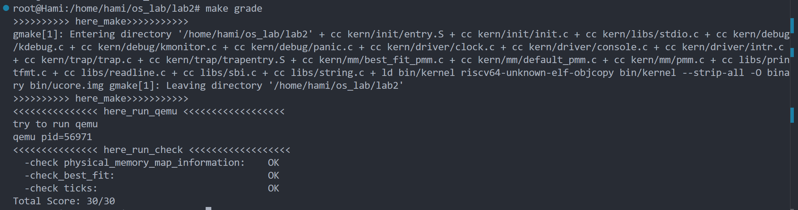
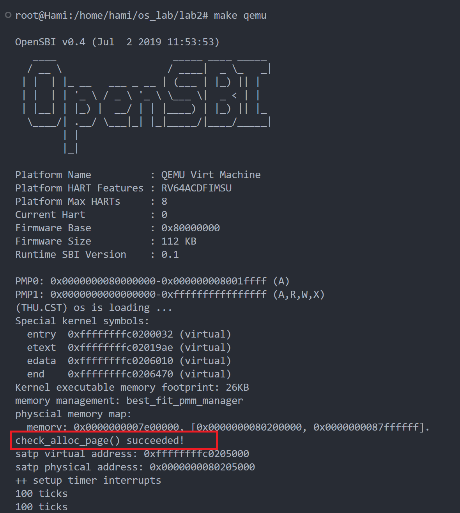
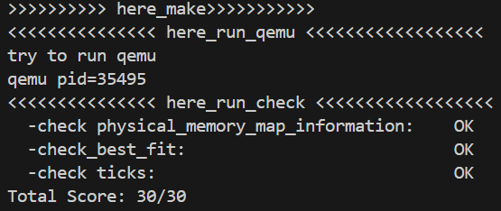

# lab2 物理内存和页表

## 练习1：理解first-fit 连续物理内存分配算法（思考题）
first-fit 连续物理内存分配算法作为物理内存分配一个很基础的方法，需要同学们理解它的实现过程。请大家仔细阅读实验手册的教程并结合kern/mm/default_pmm.c中的相关代码，认真分析default_init，default_init_memmap，default_alloc_pages， default_free_pages等相关函数，并描述程序在进行物理内存分配的过程以及各个函数的作用。 请在实验报告中简要说明你的设计实现过程。请回答如下问题：

- 你的first fit算法是否有进一步的改进空间？

## Answer
default_pmm.c 实现了基于**首次适配算法（First-Fit Memory Allocation, FFMA）** 的物理内存管理器。首次适配算法的思想是在内存请求时，从头开始查找第一个足够大的空闲块来分配。如果找到的块远大于请求的大小，则将其分割，多余部分继续保持空闲。这一实现通过**双向链表**管理内存块，并提供了内存分配、释放等操作接口。
### 关键结构与变量
- **free_area：** free_area 是用于管理空闲内存块的结构体，包含 free_list 和 nr_free。
  - free_list：空闲页块的链表，记录系统中所有可用的内存块。
  - nr_free：系统中当前空闲页的数量。
- **list_entry_t：** 用于实现双向链表的结构体。
### 初始化函数 default_init
功能：初始化内存管理器。初始化空闲页链表，开始为空。并且设置初始的空闲页数量为 0。

作用：为后续管理空闲页块打下基础。
### 内存映射初始化 default_init_memmap
功能：初始化 base 开始的 n 个页块。
- 初始化每个页：
  - 清空页的 flags 和 property，将引用计数 ref 设置为 0。
  - 将 base->property 设置为 n，表示这个块有 n 个页。
  - 更新空闲页数量 nr_free。
- 插入到空闲链表：
  - 将新的页块**按地址顺序**插入到空闲页链表 free_list 中。

作用：将物理内存划分为空闲块并加入到空闲链表中，便于后续管理。
### 分配页函数 default_alloc_pages
功能：分配 n 个连续的物理页。
- 从 free_list 中找到第一个可以容纳 n 个页的空闲块。
- 找到后，如果块的大小大于 n，则将块分为两部分：前 n 页分配给请求，剩余部分继续作为空闲块。
- 更新空闲页数量 nr_free，并返回找到的页块。

作用：实现 First Fit 算法，分配满足请求的内存块，并对空闲链表进行相应调整。
### 释放页函数 default_free_pages
功能：释放 n 个页块，将它们重新插入空闲链表。
- 初始化每个页的属性。
- 将释放的页块插入到 free_list 中，并保持链表的有序性。
- 尝试合并相邻的空闲块，以避免内存碎片化。包括前向检查（base的前面有没有相邻的块）和后向检查（base的后有没有相邻的块）。

作用：释放内存并将相邻的空闲块进行合并，减少内存碎片。
### 空闲页数量 default_nr_free_pages
功能：返回系统当前空闲页的数量，即nr_free。
### 检查函数 basic_check 和 default_check
basic_check 和 default_check 用于测试内存分配和释放是否正确。
- basic_check 进行基础的内存分配、释放测试，确保分配、释放操作的正确性。
- default_check 在 basic_check 的基础上，进行更复杂的测试，包括分配多个页块、释放页块、检查页块合并等。
### 内存管理器 default_pmm_manager
功能：定义了基于**首次适配算法**的物理内存管理器，包含了**内存初始化、分配、释放和检查等**操作函数。

通过这个结构体，pmm**机制**可以使用首次适配的内存管理**策略**来分配和管理物理内存。
### 程序在进行物理内存分配的过程
1. 内存初始化：系统在启动过程中，会调用内存管理器初始化函数来准备空闲内存的管理数据结构。这个步骤是通过 default_init 和 default_init_memmap 函数实现的。
2. 内存分配请求处理：当系统需要分配物理内存时，会调用 default_alloc_pages 函数，在空闲内存链表中找到第一个足够大的空闲块，分配给请求者。
3. 内存释放和合并：当内存不再需要时，通过 default_free_pages 函数将其释放回空闲链表，并尝试将相邻的空闲块合并，以减少内存碎片。
### 程序优缺点分析
在详细分析改进空间之前，我们先纵观程序的优缺点。优点显然是由于First Fit算法在分配时只需找到第一个满足条件的块，因此代码实现相对简单。default_alloc_pages函数中的核心查找逻辑如下：
```c
list_entry_t *le = &free_list;
while ((le = list_next(le)) != &free_list) {
    struct Page *p = le2page(le, page_link);
    if (p->property >= n) {
        page = p;
        break;
    }
}
```
然后我们来找它的缺点。首先，First Fit算法在分配时容易产生碎片，特别是在链表前端保留了很多较小的空闲块。碎片化的存在会降低内存利用率。例如，当多次分配并释放不同大小的块后，链表中的一些块可能仅剩下很小的空间。
```c
if (page->property > n) {
    struct Page *p = page + n;
    p->property = page->property - n;
    SetPageProperty(p);
    list_add(prev, &(p->page_link));
}
```
我们可以从上面的代码中看出，每次分配时会切割大块内存为两部分，虽然满足了请求，但在链表中留下了零散小块，后续小块会越来越多，导致碎片化问题。
然后是效率问题：First Fit算法在链表中遍历每个块，因此查找效率随着链表长度增加而降低。对于内存块较多的情况，这种线性查找方式导致分配效率变低：
```c
list_entry_t *le = &free_list;
while ((le = list_next(le)) != &free_list) {
    struct Page *p = le2page(le, page_link);
    if (p->property >= n) {
        page = p;
        break;
    }
}
```
我们可以看出，每次查找时均需从链表头开始遍历，导致时间复杂度为O(n)。在内存块数量较多时，逐一查找性能较差，影响整体效率。
### First Fit 算法的改进空间
根据我们刚才的分析，我们可以看出改进 First Fit 算法的核心目标在于**减少碎片化** 和 **提高查找效率**，可以考虑从如下几个方面进行改进：
1. 减少内存碎片：
由于 First Fit 每次从链表头开始查找第一个合适的块进行分配，可能会在链表前端留下很多较小的空闲块，导致外部碎片增加。
可以考虑使用 Best Fit 或 Next Fit 算法，Best Fit 通过寻找最合适的块来减少碎片，而 Next Fit 则通过从上次分配结束的位置继续查找来减少前端碎片。
1. 提高查找效率：
当前实现的查找效率是线性的 O(n)，当内存块数量较多时，查找时间较长。可以考虑将 空闲块链表改为平衡树，如 AVL 树或红黑树，以提高查找效率。
**跳表**也是一个可以考虑的数据结构，它能够在保持链表灵活性的同时提供更快的查找速度。
1. 分离不同大小的空闲块：
目前所有的空闲块都保存在一个链表中，这意味着不论请求大小如何，都需要遍历整个链表。可以考虑使用 分离空闲链表（Segregated Free List），将不同大小的块分别存储，以加速查找和分配过程。
1. 考虑改用伙伴系统（Buddy System）
伙伴系统 是一种将内存按 2 的幂次划分的方法，它能够高效地合并和分割内存块，减少碎片化问题。虽然这种方法有时会造成内存对齐浪费，但对于减少碎片和管理效率而言，是一种不错的改进。
1. 合并策略优化：
当前的合并策略是每次释放时尝试合并相邻的空闲块，这可能会带来一定的性能开销。可以考虑采用**延迟合并策略**，即在内存紧张且没有合适的空闲块时再进行合并，以减少释放时的性能影响。
### 总结
default_pmm.c 实现了基于**首次适配算法**的物理内存管理器。该文件提供了**初始化、分配、释放和检查内存**的接口。空闲页块通过**双向链表 free_list**管理，以实现动态内存分配的灵活性。首次适配算法简单高效，但可能会导致**内存碎片化**问题。

## 练习2：实现 Best-Fit 连续物理内存分配算法（需要编程）
在完成练习一后，参考kern/mm/default_pmm.c对First Fit算法的实现，编程实现Best Fit页面分配算法，算法的时空复杂度不做要求，能通过测试即可。 请在实验报告中简要说明你的设计实现过程，阐述代码是如何对物理内存进行分配和释放，并回答如下问题：
- 你的 Best-Fit 算法是否有进一步的改进空间？

## Answer
在 best_fit_pmm.c 文件中，我们实现了一个 **Best-Fit 页面分配算法**，与 First Fit 不同，Best-Fit 旨在**找到大小最接近请求大小的空闲块来进行分配**，从而最大程度地减少内存碎片。下面详细描述了内存分配和释放的过程，以及各个函数的作用，并讨论了算法是否存在改进空间。
### 初始化 (best_fit_init)
此处与 First Fit 类似，功能是初始化物理内存管理器，准备好用于管理空闲页的链表和空闲页数。具体来说，该函数实现了下述两件事情：
- 调用 list_init(&free_list) 初始化空闲页链表 free_list。
- 将空闲页计数器 nr_free 初始化为 0。
作用：为内存管理器准备初始的空闲链表和空闲页数量，用于后续的内存分配与释放。
### 内存映射初始化 (best_fit_init_memmap)
功能：初始化指定的物理内存页块，并将其加入空闲页链表中。

补全的代码如下：
```c
best_fit_init_memmap(struct Page *base, size_t n) {
    assert(n > 0);
    struct Page *p = base;
    for (; p != base + n; p ++) {
        assert(PageReserved(p));

        /*LAB2 EXERCISE 2: YOUR CODE 2213524*/ 
        // 清空当前页框的标志和属性信息，并将页框的引用计数设置为0
        p->flags = p->property = 0;
        set_page_ref(p, 0);
    }
    base->property = n;
    SetPageProperty(base);
    nr_free += n;
    if (list_empty(&free_list)) {
        list_add(&free_list, &(base->page_link));
    } else {
        list_entry_t* le = &free_list;
        while ((le = list_next(le)) != &free_list) {
            struct Page* page = le2page(le, page_link);
             /*LAB2 EXERCISE 2: YOUR CODE 2213524 2211144*/ 
            // 编写代码
            // 1、当base < page时，找到第一个大于base的页，将base插入到它前面，并退出循环
            // 2、当list_next(le) == &free_list时，若已经到达链表结尾，将base插入到链表尾部
            if (base < page) {
                list_add_before(le, &(base->page_link));
                break;
            } else if (list_next(le) == &free_list) {
                list_add(le, &(base->page_link));
                // break;
            }
        }
    }
}
```
对该函数进行说明：
- 首先，循环遍历所有页，**清空标志和属性信息**，并将引用计数设置为 0，表示这些页是可用的。
- 然后设置 `base->property = n`，并调用 `SetPageProperty(base)` 将当前页标记为一个有效的空闲块。
- 接下来，检查空闲链表是否为空，如果为空，直接添加该页块到空闲链表。如果不为空，则遍历空闲链表，找到合适的位置保持链表的有序性（按照地址递增顺序），将页块插入到正确的位置。
  - 如果当前页块的地址小于遍历到的页块，则将其插入到对应位置的前面。
  - 如果遍历到链表的最后一个元素，表示当前页块的地址是最大的，则将其插入到链表尾部。

### 分配页面 (best_fit_alloc_pages)
功能：根据 Best-Fit 算法 分配页面。

补全的代码如下：
```c
static struct Page *
best_fit_alloc_pages(size_t n) {
    assert(n > 0);
    if (n > nr_free) {
        return NULL;
    }
    struct Page *page = NULL;
    list_entry_t *le = &free_list;
    size_t min_size = nr_free + 1;
     /*LAB2 EXERCISE 2: YOUR CODE 2213524*/ 
    // 下面的代码是first-fit的部分代码，请修改下面的代码改为best-fit
    // 遍历空闲链表，查找满足需求的空闲页框
    // 如果找到满足需求的页面，记录该页面以及当前找到的最小连续空闲页框数量
    // 查找最佳适配的空闲块
    while ((le = list_next(le)) != &free_list) {
        struct Page *p = le2page(le, page_link);
        if (p->property >= n && p->property < min_size) {
            page = p;
            min_size = p->property;
        }
    }

    if (page != NULL) {
        list_entry_t *prev = list_prev(&(page->page_link));
        list_del(&(page->page_link));
        if (page->property > n) {
            struct Page *p = page + n;
            p->property = page->property - n;
            SetPageProperty(p);
            list_add(prev, &(p->page_link));
        }
        nr_free -= n;
        ClearPageProperty(page);
    }
    return page;
}
```
对该函数进行说明：

该函数实现了 **Best-Fit** 分配算法。
- 遍历空闲链表，查找大小最接近请求页数的空闲块，以减少剩余空间的浪费。
- 使用变量 `min_size` 记录当前找到的最小的符合要求的块。
- 当找到一个比 `min_size` 更小且符合请求的块时，更新 `page` 和 `min_size`。
- 找到最佳适配块后，将其从链表中删除。如果块的大小大于请求的页数，将剩余部分重新插入到空闲链表中。

### 释放页面 (best_fit_free_pages)
功能：释放内存块，并将其合并到空闲链表中。

补全的代码如下：
```c
static void
best_fit_free_pages(struct Page *base, size_t n) {
    assert(n > 0);
    struct Page *p = base;
    for (; p != base + n; p ++) {
        assert(!PageReserved(p) && !PageProperty(p));
        p->flags = 0;
        set_page_ref(p, 0);
    }
    /*LAB2 EXERCISE 2: YOUR CODE 2213524*/ 
    // 编写代码
    // 具体来说就是设置当前页块的属性为释放的页块数、并将当前页块标记为已分配状态、最后增加nr_free的值
    base->property = n;
    SetPageProperty(base);
    nr_free += n;

    if (list_empty(&free_list)) {
        list_add(&free_list, &(base->page_link));
    } else {
        list_entry_t* le = &free_list;
        while ((le = list_next(le)) != &free_list) {
            struct Page* page = le2page(le, page_link);
            if (base < page) {
                list_add_before(le, &(base->page_link));
                break;
            } else if (list_next(le) == &free_list) {
                list_add(le, &(base->page_link));
            }
        }
    }

    list_entry_t* le = list_prev(&(base->page_link));
    if (le != &free_list) {
        p = le2page(le, page_link);
        /*LAB2 EXERCISE 2: YOUR CODE 2213524 2211133*/ 
         // 编写代码
        // 1、判断前面的空闲页块是否与当前页块是连续的，如果是连续的，则将当前页块合并到前面的空闲页块中
        // 2、首先更新前一个空闲页块的大小，加上当前页块的大小
        // 3、清除当前页块的属性标记，表示不再是空闲页块
        // 4、从链表中删除当前页块
        // 5、将指针指向前一个空闲页块，以便继续检查合并后的连续空闲页块
        if (p + p->property == base) {
            p->property += base->property;
            ClearPageProperty(base);
            list_del(&(base->page_link));
            base = p;
        }
    }

    le = list_next(&(base->page_link));
    if (le != &free_list) {
        p = le2page(le, page_link);
        if (base + base->property == p) {
            base->property += p->property;
            ClearPageProperty(p);
            list_del(&(p->page_link));
        }
    }
}
```

对该函数进行说明：

该函数实现了**内存释放**和**相邻页块的合并**。

- 首先遍历所有页，将它们的属性标记为空闲，引用计数设置为 0。
- 设置 `base->property = n`，并调用 `SetPageProperty(base)` 将页块标记为有效空闲块。
- 将页块插入到空闲链表中，保持链表的有序性。
- 尝试合并相邻的空闲块：
  - 如果前一个块和当前块相邻，则将它们合并。
  - 如果当前块和后一个块相邻，也将它们合并。

通过这些步骤，`best_fit_free_pages` 确保了尽可能减少内存碎片，增加内存利用率。

### 设计说明

在设计 Best-Fit 页面分配算法时，我们基于 First Fit 算法的实现进行修改。主要的设计思路如下：

- 查找最合适的空闲块：在分配页面时，我们遍历整个空闲链表，找到大小最接近但不小于请求大小的块，这样做可以减少剩余块中的碎片。
- 管理空闲链表：使用双向链表 free_list 来记录所有空闲块，并确保在分配和释放时，链表保持有序。
- 合并相邻的空闲块：在释放页面时，检查释放的块与前后相邻块的关系，尽量将相邻的块合并，减少内存碎片。
- 代码实现结构：与 First Fit 算法类似，best_fit_init、best_fit_init_memmap、best_fit_alloc_pages、best_fit_free_pages 等函数分别实现初始化、内存块初始化、页面分配、页面释放等操作。

### 测试结果

在终端运行 make grade，测试通过：



在终端运行 make qemu，也会输出测试通过的日志：



### Best-Fit 算法的改进空间

**1. 查找效率问题**
- **问题**：**Best-Fit** 算法在查找最合适的空闲块时需要遍历整个空闲链表，因此其时间复杂度是 `O(n)`，对于较大的内存系统来说可能效率不高。
- **改进建议**：可以使用更加高效的数据结构，如**平衡二叉树**或**堆**，来管理空闲块。这样可以将查找最合适块的时间复杂度降低到 `O(log n)`，从而提高分配效率。

**2. 外部碎片问题**
- **问题**：**Best-Fit** 算法倾向于使用最合适的空闲块，这可能导致较多的小碎片，增加外部碎片的数量。
- **改进建议**：可以引入**延迟合并**策略，定期合并小碎片，或者结合**伙伴系统**，将大小相似的块合并以减少外部碎片。此外，可以考虑在内存分配时，使用类似**Next-Fit** 的策略以分散碎片的位置。

**3. 内存合并的复杂性**
- **问题**：在 `best_fit_free_pages` 函数中，需要遍历空闲链表以找到合适的插入位置，同时还要进行前后相邻块的合并，增加了代码复杂度和运行时间。
- **改进建议**：可以将空闲块按大小和地址分别维护两个链表，或者使用双链表结构同时记录按地址排序和按大小排序，从而在释放和合并时提高效率。

## 扩展练习Challenge：`buddy system`（伙伴系统）分配算法（需要编程）
## Answer


## 扩展练习Challenge：硬件的可用物理内存范围的获取方法（思考题）
如果 OS 无法提前知道当前硬件的可用物理内存范围，请问你有何办法让 OS 获取可用物理内存范围？
### 实现思路
经过一些资料的查阅，想让操作系统动态获取物理内存的可用范围，我们可以使用引导加载器提供的硬件资源扫描信息。以下是一些可能实现步骤：

1. 利用引导加载器传递的内存映射信息
在系统启动时，引导加载器会扫描硬件资源（包括内存）并记录到一份内存映射表（例如DTB），并在传递控制权给内核时将DTB地址存入寄存器a1。

2. 检索并解析内存映射信息
在操作系统启动后，pmm_init()函数可以通过读取寄存器的值来获取DTB的起始地址。DTB格式中包括物理内存地址范围的定义，操作系统可以遍历其结构找到memory节点，该节点中详细记录了内存的物理起始地址和大小。

3. 初始化物理内存管理器
在解析到内存的范围后，将其用于初始化物理内存管理器。我们在pmm_init()中调用init_memmap()函数，将解析得到的物理地址和大小按页分配给内存管理器。以实验中的代码为例：

```c
void pmm_init() {
    uint64_t mem_start, mem_size;

    // 解析DTB，提取物理内存的起始地址和大小
    if (parse_dtb(dtb_address, &mem_start, &mem_size)) {
        init_memmap(pa2page(mem_start), mem_size / PGSIZE);
    } else {
        panic("Failed to retrieve memory layout");
    }
}
```
4. 内存探测（Memory Probing）

如果没有 BIOS 或 UEFI 的支持，操作系统可以通过探测内存的方法来获取可用物理内存范围：

- 逐段读写探测 (Brute-Force Probing)：

在系统启动的过程中，操作系统可以尝试向不同的内存地址写入一些数据，然后读取回来进行验证。这种方法可以找到哪些内存地址可以正常访问，以此来确定物理内存的边界。
        
这种方法比较原始，而且有风险，因为操作系统可能会覆盖到一些关键数据或访问无效的物理地址，从而导致系统崩溃。为了减少风险，可以使用递增的步长（例如 1MB 一次）来逐步检测。

- 基于内存控制器的探测：

在一些嵌入式系统或微控制器中，内存控制器通常有寄存器可以提供可用内存的相关信息，操作系统可以直接读取这些寄存器来了解系统中有多少可用的物理内存。