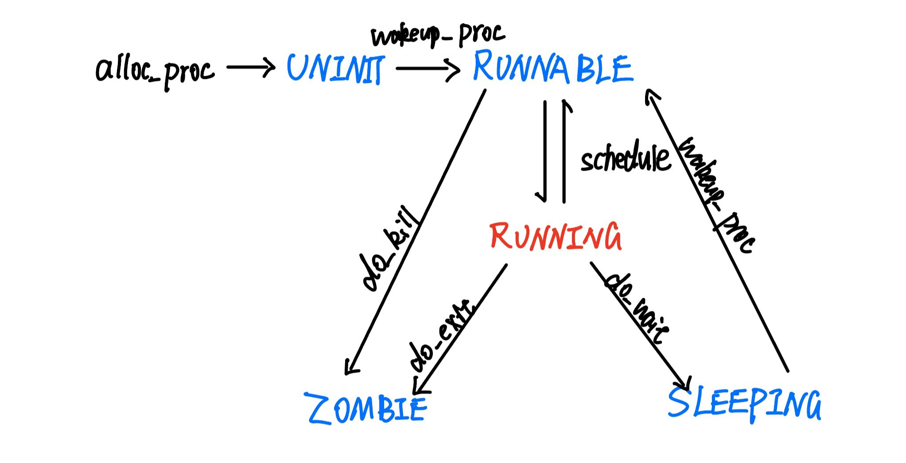

# lab5:用户程序

## 练习1: 加载应用程序并执行（需要编码）
do_execv函数调用`load_icode`（位于kern/process/proc.c中）来加载并解析一个处于内存中的ELF执行文件格式的应用程序。你需要补充`load_icode`的第6步，建立相应的用户内存空间来放置应用程序的代码段、数据段等，且要设置好`proc_struct`结构中的成员变量trapframe中的内容，确保在执行此进程后，能够从应用程序设定的起始执行地址开始执行。需设置正确的trapframe内容。

请在实验报告中简要说明你的设计实现过程。

- 请简要描述这个用户态进程被ucore选择占用CPU执行（RUNNING态）到具体执行应用程序第一条指令的整个经过。

## Answer:

### 1. **完善 `load_icode` 函数的第6步**

在 `load_icode` 函数中，第6步的任务是设置 `trapframe` 以确保新加载的用户进程能够从应用程序设定的起始执行地址开始执行。具体来说，需要正确初始化 `trapframe` 结构体中的关键成员，包括栈指针 (`sp`)、程序计数器 (`epc`) 和状态寄存器 (`status`)。

以下是补充完善后的 `load_icode` 函数：

```c
/* load_icode - load the content of binary program(ELF format) as the new content of current process
 * @binary:  the memory addr of the content of binary program
 * @size:    the size of the content of binary program
 */
static int
load_icode(unsigned char *binary, size_t size) {
    if (current->mm != NULL) {
        panic("load_icode: current->mm must be empty.\n");
    }

    int ret = -E_NO_MEM;
    struct mm_struct *mm;
    //(1) create a new mm for current process
    if ((mm = mm_create()) == NULL) {
        goto bad_mm;
    }
    //(2) create a new PDT, and mm->pgdir= kernel virtual addr of PDT
    if (setup_pgdir(mm) != 0) {
        goto bad_pgdir_cleanup_mm;
    }
    //(3) copy TEXT/DATA section, build BSS parts in binary to memory space of process
    struct Page *page;
    //(3.1) get the file header of the binary program (ELF format)
    struct elfhdr *elf = (struct elfhdr *)binary;
    //(3.2) get the entry of the program section headers of the binary program (ELF format)
    struct proghdr *ph = (struct proghdr *)(binary + elf->e_phoff);
    //(3.3) This program is valid?
    if (elf->e_magic != ELF_MAGIC) {
        ret = -E_INVAL_ELF;
        goto bad_elf_cleanup_pgdir;
    }

    uint32_t vm_flags, perm;
    struct proghdr *ph_end = ph + elf->e_phnum;
    for (; ph < ph_end; ph ++) {
    //(3.4) find every program section headers
        if (ph->p_type != ELF_PT_LOAD) {
            continue ;
        }
        if (ph->p_filesz > ph->p_memsz) {
            ret = -E_INVAL_ELF;
            goto bad_cleanup_mmap;
        }
        if (ph->p_filesz == 0) {
            // continue ;
        }
    //(3.5) call mm_map fun to setup the new vma ( ph->p_va, ph->p_memsz)
        vm_flags = 0, perm = PTE_U | PTE_V;
        if (ph->p_flags & ELF_PF_X) vm_flags |= VM_EXEC;
        if (ph->p_flags & ELF_PF_W) vm_flags |= VM_WRITE;
        if (ph->p_flags & ELF_PF_R) vm_flags |= VM_READ;
        // modify the perm bits here for RISC-V
        if (vm_flags & VM_READ) perm |= PTE_R;
        if (vm_flags & VM_WRITE) perm |= (PTE_W | PTE_R);
        if (vm_flags & VM_EXEC) perm |= PTE_X;
        if ((ret = mm_map(mm, ph->p_va, ph->p_memsz, vm_flags, NULL)) != 0) {
            goto bad_cleanup_mmap;
        }
        unsigned char *from = binary + ph->p_offset;
        size_t off, size;
        uintptr_t start = ph->p_va, end, la = ROUNDDOWN(start, PGSIZE);

        ret = -E_NO_MEM;

     //(3.6) alloc memory, and copy the contents of every program section (from, from+end) to process's memory (la, la+end)
        end = ph->p_va + ph->p_filesz;
     //(3.6.1) copy TEXT/DATA section of binary program
        while (start < end) {
            if ((page = pgdir_alloc_page(mm->pgdir, la, perm)) == NULL) {
                goto bad_cleanup_mmap;
            }
            off = start - la, size = PGSIZE - off, la += PGSIZE;
            if (end < la) {
                size -= la - end;
            }
            memcpy(page2kva(page) + off, from, size);
            start += size, from += size;
        }

      //(3.6.2) build BSS section of binary program
        end = ph->p_va + ph->p_memsz;
        if (start < la) {
            /* ph->p_memsz == ph->p_filesz */
            if (start == end) {
                continue ;
            }
            off = start + PGSIZE - la, size = PGSIZE - off;
            if (end < la) {
                size -= la - end;
            }
            memset(page2kva(page) + off, 0, size);
            start += size;
            assert((end < la && start == end) || (end >= la && start == la));
        }
        while (start < end) {
            if ((page = pgdir_alloc_page(mm->pgdir, la, perm)) == NULL) {
                goto bad_cleanup_mmap;
            }
            off = start - la, size = PGSIZE - off, la += PGSIZE;
            if (end < la) {
                size -= la - end;
            }
            memset(page2kva(page) + off, 0, size);
            start += size;
        }
    }
    //(4) build user stack memory
    vm_flags = VM_READ | VM_WRITE | VM_STACK;
    if ((ret = mm_map(mm, USTACKTOP - USTACKSIZE, USTACKSIZE, vm_flags, NULL)) != 0) {
        goto bad_cleanup_mmap;
    }
    assert(pgdir_alloc_page(mm->pgdir, USTACKTOP-PGSIZE , PTE_USER) != NULL);
    assert(pgdir_alloc_page(mm->pgdir, USTACKTOP-2*PGSIZE , PTE_USER) != NULL);
    assert(pgdir_alloc_page(mm->pgdir, USTACKTOP-3*PGSIZE , PTE_USER) != NULL);
    assert(pgdir_alloc_page(mm->pgdir, USTACKTOP-4*PGSIZE , PTE_USER) != NULL);
    
    //(5) set current process's mm, sr3, and set CR3 reg = physical addr of Page Directory
    mm_count_inc(mm);
    current->mm = mm;
    current->cr3 = PADDR(mm->pgdir);
    lcr3(PADDR(mm->pgdir));

    //(6) setup trapframe for user environment
    struct trapframe *tf = current->tf;
    // Keep sstatus
    uintptr_t sstatus = tf->status;
    memset(tf, 0, sizeof(struct trapframe));
    /* LAB5:EXERCISE1 YOUR CODE
     * should set tf->gpr.sp, tf->epc, tf->status
     * NOTICE: If we set trapframe correctly, then the user level process can return to USER MODE from kernel. So
     *          tf->gpr.sp should be user stack top (the value of sp)
     *          tf->epc should be entry point of user program (the value of sepc)
     *          tf->status should be appropriate for user program (the value of sstatus)
     *          hint: check meaning of SPP, SPIE in SSTATUS, use them by SSTATUS_SPP, SSTATUS_SPIE(defined in risv.h)
     */

    // 3.1 设置用户栈指针
    tf->gpr.sp=USTACKTOP;

    // 3.2 设置程序计数器到用户程序的入口点，elf->e_entry是程序入口地址,定义在elf.h中
    tf->epc=elf->e_entry;

    // 3.3 设置状态寄存器
    // 将 SPP 清零（用户模式），设置 SPIE 位以启用中断
    tf->status=(sstatus|SSTATUS_SPIE)&(~SSTATUS_SPP);

    ret = 0;
out:
    return ret;
bad_cleanup_mmap:
    exit_mmap(mm);
bad_elf_cleanup_pgdir:
    put_pgdir(mm);
bad_pgdir_cleanup_mm:
    mm_destroy(mm);
bad_mm:
    goto out;
}
```

### 2. **设计实现过程简述**

#### 2.1 **创建内存管理结构 (`mm_struct`)**

首先，检查当前进程是否已有内存管理结构体 (`mm_struct`)。如果有，调用 `panic` 函数，因为 `load_icode` 应用于没有内存映射的进程。

```c
if (current->mm != NULL) {
    panic("load_icode: current->mm must be empty.\n");
}
```

#### 2.2 **创建页目录表 (Page Directory Table, PDT)**

调用 `mm_create` 创建一个新的 `mm_struct`，然后通过 `setup_pgdir` 初始化页目录表。如果任一步骤失败，进行相应的错误处理。

```c
if ((mm = mm_create()) == NULL) {
    goto bad_mm;
}
if (setup_pgdir(mm) != 0) {
    goto bad_pgdir_cleanup_mm;
}
```

#### 2.3 **解析 ELF 文件并映射内存**

遍历 ELF 文件的程序头表，找到所有类型为 `ELF_PT_LOAD` 的段，调用 `mm_map` 为每个段设置虚拟内存区域，并分配物理页面将程序内容复制到相应的虚拟地址空间。同时，处理 BSS 段，将其初始化为零。

```c
struct elfhdr *elf = (struct elfhdr *)binary;
struct proghdr *ph = (struct proghdr *)(binary + elf->e_phoff);
if (elf->e_magic != ELF_MAGIC) {
    ret = -E_INVAL_ELF;
    goto bad_elf_cleanup_pgdir;
}

for (; ph < ph_end; ph ++) {
    if (ph->p_type != ELF_PT_LOAD) {
        continue ;
    }
    if (ph->p_filesz > ph->p_memsz) {
        ret = -E_INVAL_ELF;
        goto bad_cleanup_mmap;
    }
    // 设置内存访问权限
    // 调用 mm_map 映射虚拟地址
    // 分配物理页面并复制内容
    // 初始化 BSS 段
}
```

#### 2.4 **建立用户栈**

调用 `mm_map` 为用户栈分配内存空间，并分配多个物理页面确保栈的完整性。

```c
vm_flags = VM_READ | VM_WRITE | VM_STACK;
if ((ret = mm_map(mm, USTACKTOP - USTACKSIZE, USTACKSIZE, vm_flags, NULL)) != 0) {
    goto bad_cleanup_mmap;
}
assert(pgdir_alloc_page(mm->pgdir, USTACKTOP-PGSIZE , PTE_USER) != NULL);
assert(pgdir_alloc_page(mm->pgdir, USTACKTOP-2*PGSIZE , PTE_USER) != NULL);
assert(pgdir_alloc_page(mm->pgdir, USTACKTOP-3*PGSIZE , PTE_USER) != NULL);
assert(pgdir_alloc_page(mm->pgdir, USTACKTOP-4*PGSIZE , PTE_USER) != NULL);
```

#### 2.5 **设置进程的内存管理和页目录表**

增加 `mm_struct` 的引用计数，设置当前进程的内存管理结构和页目录表的物理地址，并切换到新的页目录表。

```c
mm_count_inc(mm);
current->mm = mm;
current->cr3 = PADDR(mm->pgdir);
lcr3(PADDR(mm->pgdir));
```

#### 2.6 **设置 `trapframe` 以启动用户程序**

这是关键步骤，确保新进程能够从用户程序的入口地址开始执行，并且具有正确的执行环境。

```c
struct trapframe *user_tf = current->tf;
// 保留原有的 sstatus
uintptr_t sstatus = user_tf->status;
// 清空 trapframe
memset(user_tf, 0, sizeof(struct trapframe));
// 3.1 设置用户栈指针
    tf->gpr.sp=USTACKTOP;

    // 3.2 设置程序计数器到用户程序的入口点，elf->e_entry是程序入口地址,定义在elf.h中
    tf->epc=elf->e_entry;

    // 3.3 设置状态寄存器
    // 将 SPP 清零（用户模式），设置 SPIE 位以启用中断
    tf->status=(sstatus|SSTATUS_SPIE)&(~SSTATUS_SPP);

    ret = 0;
```

**详细说明：**

1. **保留原有的 `sstatus`**：
   - 保存陷阱发生时的 `status` 寄存器值，以便在设置新的 `status` 时保留必要的状态信息。

2. **清空 `trapframe`**：
   - 使用 `memset` 将 `trapframe` 结构体清零，确保所有字段被初始化，避免未初始化的数据导致不可预知的行为。

3. **设置用户栈指针 (`sp`)**：
   - 将 `sp` 设置为用户栈的顶端地址 `USTACKTOP`，确保用户程序在执行时有一个有效的栈空间。

4. **设置程序计数器 (`epc`)**：
   - 将 `epc` 设置为 ELF 文件中的入口点地址 `e_entry`，确保用户程序从正确的起始地址开始执行。

5. **设置状态寄存器 (`status`)**：
   - 清除 `SPP` 位（Supervisor Previous Privilege），将执行权限设置为用户模式。
   - 设置 `SPIE` 位（Supervisor Previous Interrupt Enable），启用中断，使用户程序在返回时能够响应中断。

#### 2.7 **完成函数并返回**

设置完成后，将 `ret` 设为 `0` 表示成功，并跳转到 `out` 标签返回。

```c
ret = 0;
out:
    return ret;
```

### 3. **用户态进程从被调度到执行第一条指令的过程**

以下是用户态进程从被 ucore 调度为 RUNNING 状态，到执行应用程序第一条指令的完整过程：

1. **进程创建与初始化**：
   - 调用 `do_execve` 系统调用，内部调用 `load_icode` 函数加载并解析 ELF 文件。
   - `load_icode` 函数完成内存映射、栈建立和 `trapframe` 设置，确保新进程拥有独立的地址空间和正确的执行环境。

2. **将进程状态设置为可运行**：
   - 在 `do_execve` 或 `load_icode` 完成后，进程的状态被设置为 `PROC_RUNNABLE`，表示该进程可以被调度器调度执行。

3. **进程调度**：
   - 调度器（`schedule` 函数）选择一个可运行的进程（包括刚刚加载的用户进程）进行执行。
   - 调用 `proc_run` 函数，将选中的进程调度到 CPU 上运行。

4. **上下文切换**：
   - 在 `proc_run` 中，通过禁用中断、切换页目录表和调用 `switch_to` 函数实现上下文切换。
   - `switch_to` 函数保存当前进程的上下文（寄存器状态等），并恢复即将运行的进程的上下文。

5. **恢复用户态执行环境**：
   - 恢复后的进程拥有其对应的 `trapframe`，包括用户栈指针 (`sp`)、程序计数器 (`epc`) 和状态寄存器 (`status`)。
   - 通过 `lcr3` 切换到进程的页目录表，确保虚拟内存映射正确。

6. **从用户态返回执行**：
   - 调用 `usertrapret` 或类似的函数，利用 `trapframe` 中保存的状态恢复用户态执行。
   - CPU 从内核态切换回用户态，开始执行用户程序的第一条指令，从 `epc` 指定的入口地址开始。

7. **执行用户程序**：
   - 用户程序的第一条指令在正确的用户态和地址空间中开始执行。
   - 用户程序按照其代码逻辑运行，使用设置好的栈空间和数据段。


## 练习2: 父进程复制自己的内存空间给子进程（需要编码）
创建子进程的函数`do_fork`在执行中将拷贝当前进程（即父进程）的用户内存地址空间中的合法内容到新进程中（子进程），完成内存资源的复制。具体是通过`copy_range`函数（位于kern/mm/pmm.c中）实现的，请补充`copy_range`的实现，确保能够正确执行。

请在实验报告中简要说明你的设计实现过程。

- 如何设计实现Copy on Write机制？给出概要设计，鼓励给出详细设计。
> Copy-on-write（简称COW）的基本概念是指如果有多个使用者对一个资源A（比如内存块）进行读操作，则每个使用者只需获得一个指向同一个资源A的指针，就可以该资源了。若某使用者需要对这个资源A进行写操作，系统会对该资源进行拷贝操作，从而使得该“写操作”使用者获得一个该资源A的“私有”拷贝—资源B，可对资源B进行写操作。该“写操作”使用者对资源B的改变对于其他的使用者而言是不可见的，因为其他使用者看到的还是资源A。

## Answer：
### 实现过程
```c++
// 获取源页面所在的虚拟地址（注意，此时的PDT是内核状态下的页目录表）
void * kva_src=page2kva(page);
// 获取目标页面所在的虚拟地址
void * kva_dst=page2kva(npage);
// 页面数据复制
memcpy(kva_dst,kva_src,PGSIZE);
//将该页面设置至对应的PTE中
ret = page_insert(to, npage, start, perm);
```
我们在`do_fork()`中调用`copy_mm()`，该函数会根据`clone_flags`来确定是否需要克隆使用当前进程的进程管理结构。如果不需要，我们新建一个新的mm结构体并设置其中的页表基地址。我们对`oldmm`上锁，之后进入`dup_mmap(mm, oldmm)`。

在`dup_mmap(mm, oldmm)`中，我们循环把双向链表上的每一块VMA卸下并创造同一范围内的nvma挂到新的`mmstruct`，随后进入`cpoy_range()`。

在`copy_range()`中，我们从`start`开始在`from`页表上找页表项，在`to`页表上同样找页表项，如果没有找到则创建一个新的页表项。我们找到from页表项指向的物理页（page结构体），然后分配一个页结构体给进程B，获取两个页结构体管理的页的实际虚拟地址后把from页的内容复制到to页的内容中，最后把页和页表项关联起来，并通过perm设置其权限。

### COW的概要设计
当一个用户父进程创建子进程时，父进程会将申请的用户内存空间设置为只读状态，而子进程则可以共享父进程的用户内存空间中的页面。当父进程或子进程尝试修改此用户内存空间中的某页面时，系统能够通过`page fault`异常机制检测到这一操作，并自动进行内存页面的拷贝。这一过程确保了两个进程各自拥有独立的内存页面，从而使得一个进程对内存的修改不会影响到另一个进程。

- **页目录表的拷贝**：在执行`do_fork`时，子进程的页目录表会直接拷贝自父进程的页目录表。在`dup_mmap`过程中，只需保留拷贝虚拟内存区域（VMA）链表的部分，而无需调用`copy_range`来为子进程分配新的物理内存。

- **内存页面的共享**：父进程的内存空间对应的所有Page结构的引用计数（ref）均会加1，以表明子进程也在使用这些内存页面。

- **写权限的控制**：父子进程的页目录表的写权限会被取消。当父进程或子进程尝试执行写操作时，将触发页面访问异常。系统随后会进入页面访问异常处理函数，在该函数中进行内存拷贝，并恢复页目录表的写权限，确保两个进程的内存空间独立且互不影响。

## 练习3: 阅读分析源代码，理解进程执行 fork/exec/wait/exit 的实现，以及系统调用的实现（不需要编码）
请在实验报告中简要说明你对 fork/exec/wait/exit函数的分析。并回答如下问题：

请分析fork/exec/wait/exit的执行流程。重点关注哪些操作是在用户态完成，哪些是在内核态完成？内核态与用户态程序是如何交错执行的？内核态执行结果是如何返回给用户程序的？
请给出ucore中一个用户态进程的执行状态生命周期图（包执行状态，执行状态之间的变换关系，以及产生变换的事件或函数调用）。（字符方式画即可）
执行：make grade。如果所显示的应用程序检测都输出ok，则基本正确。（使用的是qemu-1.0.1）
### fork流程：
fork用于创建一个子进程，在用户态中，用户程序会调用 fork()函数，而这个函数会最终调用 sys_fork 系统接口。进入内核态后，其内核实现如下：
```c++
int sys_fork(uint64_t arg[]) {
    struct trapframe *tf = current->tf;
    uintptr_t stack = tf->gpr.sp;
    return do_fork(0, stack, tf);
}

```
它接下来会调用 do_fork 执行核心逻辑：
```c++
int
do_fork(uint32_t clone_flags, uintptr_t stack, struct trapframe *tf) {
    int ret = -E_NO_FREE_PROC;
    struct proc_struct *proc;
    if (nr_process >= MAX_PROCESS) {
        goto fork_out;
    }
    ret = -E_NO_MEM;
   
   // 1. 调用 alloc_proc 分配一个新的 proc_struct
    if ((proc = alloc_proc()) == NULL) {
        goto fork_out;
    }

    // 2. 设置子进程的父进程指针为当前进程，并确保父进程的 wait_state 为 0
    proc->parent = current;
    // current->wait_state = 0;
    assert(current->wait_state==0);

    // 3. 调用 setup_kstack 为子进程分配内核栈
    if (setup_kstack(proc) != 0) {
        // ret = -E_NO_MEM;
        goto bad_fork_cleanup_kstack;
    }

    // 4. 调用 copy_mm 复制或共享内存管理结构
    if (copy_mm(clone_flags, proc) != 0) {
        // ret = -E_NO_MEM;
        goto bad_fork_cleanup_proc;
    }

    // 5. 调用 copy_thread 复制线程上下文和陷阱帧
    copy_thread(proc, stack, tf);

    // 6. 调用 get_pid 分配一个唯一的 PID 给子进程，将子进程插入到哈希表和进程链表中，并设置进程间关系
    bool intr_flag;
    local_intr_save(intr_flag);
    {
        proc->pid=get_pid();
        hash_proc(proc);
        set_links(proc);
    }
    local_intr_restore(intr_flag);

    

    // 7. 唤醒子进程
    // proc->state = PROC_RUNNABLE;
    wakeup_proc(proc);

    // 8. 设置返回值为子进程的 PID
    ret = proc->pid;
 
fork_out:
    return ret;

bad_fork_cleanup_kstack:
    put_kstack(proc);
bad_fork_cleanup_proc:
    kfree(proc);
    goto fork_out;
}
```
其结果会返回用户态。父进程收到子进程的 PID，而子进程收到返回值 0。
### exec流程：
exec 用于加载新的可执行程序替换当前进程的内存映像。一开始在用户态的过程与上一个类似，用户程序调用的execve，会通过封装的系统调用 sys_exec 进入内核，其实现为：
```c++
int sys_exec(uint64_t arg[]) {
    const char *name = (const char *)arg[0];
    size_t len = (size_t)arg[1];
    unsigned char *binary = (unsigned char *)arg[2];
    size_t size = (size_t)arg[3];
    return do_execve(name, len, binary, size);
}
```
而在内核中其核心为do_execve()函数，它通过加载一个新的二进制可执行文件来替换当前进程的内存空间，并为新的程序设置执行环境。具体而言，它会先检查当前进程所分配的内存区域、进行一些资源的回收等。然后调用 load_icode 函数加载新的 ELF 二进制文件，它会根据ELFheader分配特定位置的虚拟内存，并加载代码与数据至特定的内存地址，最后分配堆栈并设置trapframe属性。最后使用 set_proc_name 函数更新当前进程的名称。
```c++
int
do_execve(const char *name, size_t len, unsigned char *binary, size_t size) {
    struct mm_struct *mm = current->mm;
    if (!user_mem_check(mm, (uintptr_t)name, len, 0)) {
        return -E_INVAL;
    }
    if (len > PROC_NAME_LEN) {
        len = PROC_NAME_LEN;
    }

    char local_name[PROC_NAME_LEN + 1];
    memset(local_name, 0, sizeof(local_name));
    memcpy(local_name, name, len);

    if (mm != NULL) {
        cputs("mm != NULL");
        lcr3(boot_cr3);
        if (mm_count_dec(mm) == 0) {
            exit_mmap(mm);
            put_pgdir(mm);
            mm_destroy(mm);
        }
        current->mm = NULL;
    }
    int ret;
    if ((ret = load_icode(binary, size)) != 0) {
        goto execve_exit;
    }
    set_proc_name(current, local_name);
    return 0;

execve_exit:
    do_exit(ret);
    panic("already exit: %e.\n", ret);
}
```
函数释放除了PCB以外原进程所有的资源，只原进程的PID、原进程的属性、原进程与其他进程之间的关系等等。
最后内核返回 0 表示执行成功。在用户态中，当前进程的代码段、数据段被替换为新程序，继续执行新程序的入口点。
### wait流程：
wait 用于等待子进程结束并回收其资源。用户程序首先调用 wait()，通过 sys_wait 进入内核。
内核态中 sys_wait 的实现为：
```c++
int sys_wait(uint64_t arg[]) {
    int pid = (int)arg[0];
    int *store = (int *)arg[1];
    return do_wait(pid, store);
}
```
核心部分还是do_wait函数，它会使某个进程一直等待，直到特定子进程退出后，才会进行资源回收和函数返回。具体而言，函数遍历当前进程的子进程，检查是否有子进程处于 PROC_ZOMBIE 状态。如果存在，则清理子进程的资源，并返回子进程的退出码。如果不存在，则设置父进程为 PROC_SLEEPING 状态，等待子进程状态变化。
```c++
int
do_wait(int pid, int *code_store) {
    struct mm_struct *mm = current->mm;
    if (code_store != NULL) {
        if (!user_mem_check(mm, (uintptr_t)code_store, sizeof(int), 1)) {
            return -E_INVAL;
        }
    }

    struct proc_struct *proc;
    bool intr_flag, haskid;
repeat:
    haskid = 0;
    if (pid != 0) {
        proc = find_proc(pid);
        if (proc != NULL && proc->parent == current) {
            haskid = 1;
            if (proc->state == PROC_ZOMBIE) {
                goto found;
            }
        }
    }
    else {
        proc = current->cptr;
        for (; proc != NULL; proc = proc->optr) {
            haskid = 1;
            if (proc->state == PROC_ZOMBIE) {
                goto found;
            }
        }
    }
    if (haskid) {
        current->state = PROC_SLEEPING;
        current->wait_state = WT_CHILD;
        schedule();
        if (current->flags & PF_EXITING) {
            do_exit(-E_KILLED);
        }
        goto repeat;
    }
    return -E_BAD_PROC;

found:
    if (proc == idleproc || proc == initproc) {
        panic("wait idleproc or initproc.\n");
    }
    if (code_store != NULL) {
        *code_store = proc->exit_code;
    }
    local_intr_save(intr_flag);
    {
        unhash_proc(proc);
        remove_links(proc);
    }
    local_intr_restore(intr_flag);
    put_kstack(proc);
    kfree(proc);
    return 0;
}
```
返回用户态中，wait会返回子进程的退出码。
### exit流程：
exit 用于结束当前进程，前面从用户态进入内核态的过程与前三个类似，这里不再赘述。主要需要介绍do_exit的实现：
```c++
int
do_exit(int error_code) {
    if (current == idleproc) {
        panic("idleproc exit.\n");
    }
    if (current == initproc) {
        panic("initproc exit.\n");
    }
    struct mm_struct *mm = current->mm;
    if (mm != NULL) {
        lcr3(boot_cr3);
        if (mm_count_dec(mm) == 0) {
            exit_mmap(mm);
            put_pgdir(mm);
            mm_destroy(mm);
        }
        current->mm = NULL;
    }
    current->state = PROC_ZOMBIE;
    current->exit_code = error_code;
    bool intr_flag;
    struct proc_struct *proc;
    local_intr_save(intr_flag);
    {
        proc = current->parent;
        if (proc->wait_state == WT_CHILD) {
            wakeup_proc(proc);
        }
        while (current->cptr != NULL) {
            proc = current->cptr;
            current->cptr = proc->optr;
    
            proc->yptr = NULL;
            if ((proc->optr = initproc->cptr) != NULL) {
                initproc->cptr->yptr = proc;
            }
            proc->parent = initproc;
            initproc->cptr = proc;
            if (proc->state == PROC_ZOMBIE) {
                if (initproc->wait_state == WT_CHILD) {
                    wakeup_proc(initproc);
                }
            }
        }
    }
    local_intr_restore(intr_flag);
    schedule();
    panic("do_exit will not return!! %d.\n", current->pid);
}
```
当进程终止时，需回收其所有内存（除PCB），设置状态为PROC_ZOMBIE并保存退出码。如果有父进程，则唤醒其回收PCB；若无父进程，将子进程的父进程设为initproc以负责资源回收。最后触发调度机制，父进程调度后可立即回收该进程的PCB。

值得一提的是，这一步就无法返回用户态了，因为进程资源都会被回收。
### 系统调用：
内核部分通过syscall为用户程序提供内核服务。用户态中实现如下：
```c++
static inline int
syscall(int64_t num, ...) {
    va_list ap;
    va_start(ap, num);
    uint64_t a[MAX_ARGS];
    int i, ret;
    for (i = 0; i < MAX_ARGS; i ++) {
        a[i] = va_arg(ap, uint64_t);
    }
    va_end(ap);

    asm volatile (
        "ld a0, %1\n"
        "ld a1, %2\n"
        "ld a2, %3\n"
        "ld a3, %4\n"
        "ld a4, %5\n"
    	"ld a5, %6\n"
        "ecall\n"
        "sd a0, %0"
        : "=m" (ret)
        : "m"(num), "m"(a[0]), "m"(a[1]), "m"(a[2]), "m"(a[3]), "m"(a[4])
        :"memory");
    return ret;
}
```
这个函数会设置%eax, %edx, %ecx, %ebx, %edi, %esi五个寄存器的值分别为调用号、参数1、参数2、参数3、参数4、参数5，然后执行int中断进入中断处理例程。

在中断处理中，程序会根据中断号，执行内核中的syscall函数，它会取出六个寄存器的值，并根据系统调用号来执行不同的系统调用：
```c++
void
syscall(void) {
    struct trapframe *tf = current->tf;
    uint64_t arg[5];
    int num = tf->gpr.a0;
    if (num >= 0 && num < NUM_SYSCALLS) {
        if (syscalls[num] != NULL) {
            arg[0] = tf->gpr.a1;
            arg[1] = tf->gpr.a2;
            arg[2] = tf->gpr.a3;
            arg[3] = tf->gpr.a4;
            arg[4] = tf->gpr.a5;
            tf->gpr.a0 = syscalls[num](arg);
            return ;
        }
    }
    print_trapframe(tf);
    panic("undefined syscall %d, pid = %d, name = %s.\n",
            num, current->pid, current->name);
}
```
结束后，程序通过之前保留的trapframe返回用户态。
### 执行状态分析：
在进程管理中，fork会将子进程状态设为PROC_RUNNABLE，而当前进程状态保持不变；exec不会改变当前进程状态，但会替换其内存空间中的数据和代码；wait会检查子进程状态，若有PROC_ZOMBIE子进程则回收并返回，否则当前进程进入PROC_SLEEPING状态等待子进程唤醒；exit将当前进程状态设置为PROC_ZOMBIE，唤醒父进程使其变为PROC_RUNNABLE，并主动释放CPU。



## Challenge：实现 Copy on Write （COW）机制

给出实现源码,测试用例和设计报告（包括在cow情况下的各种状态转换（类似有限状态自动机）的说明）。

这个扩展练习涉及到本实验和上一个实验“虚拟内存管理”。在ucore操作系统中，当一个用户父进程创建自己的子进程时，父进程会把其申请的用户空间设置为只读，子进程可共享父进程占用的用户内存空间中的页面（这就是一个共享的资源）。当其中任何一个进程修改此用户内存空间中的某页面时，ucore会通过page fault异常获知该操作，并完成拷贝内存页面，使得两个进程都有各自的内存页面。这样一个进程所做的修改不会被另外一个进程可见了。请在ucore中实现这样的COW机制。

## Challenge：说明该用户程序是何时被预先加载到内存中的？与我们常用操作系统的加载有何区别，原因是什么？